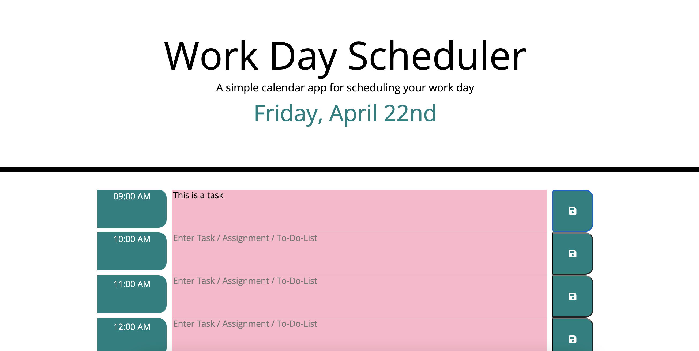
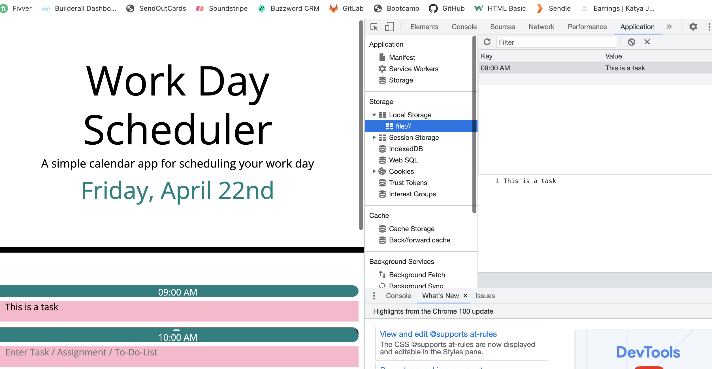

# work-day-scheduler

## Module 5 challenge 

### Katya Juliet Lerner Links 

Public Repo https://github.com/katyajuliet/work-day-scheduler

Live Page Link https://katyajuliet.github.io/work-day-scheduler/

#### Description
A work day scheduler, 9am to 5pm, that allows user to enter and save tasks on the hour, with color coding as hours pass or remain ahead into the future. When the site is refreshed the local storage saves the elements added into the description field. 

The page is mobile responsive and uses bootstrap elements in HTML. 

Content includes HTML, CSS, JS 

##### Screenshots

